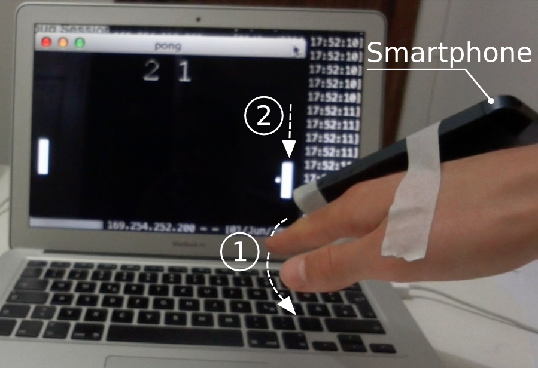
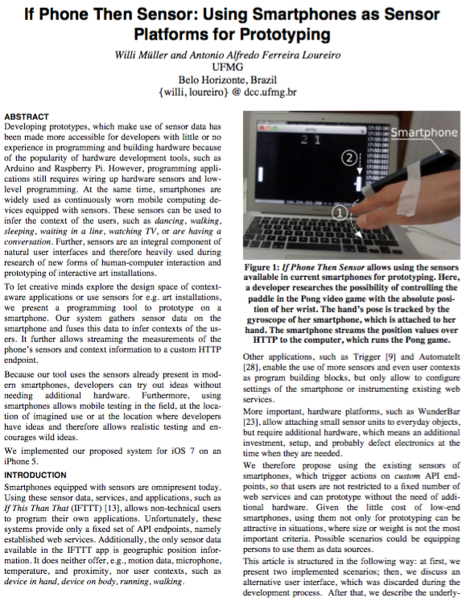

# If Phone Then Sensor: Exploring Smartphones as Sensor Platforms for Prototyping

If Phone Then Sensor allows using the sensors available in current smartphones for prototyping. Here, a developer researches the possibility of controlling the paddle in the Pong video game with the absolute posi- tion of her wrist. The hand’s pose is tracked by the gyroscope of her smartphone, which is attached to her hand. The smartphone streams the position values over HTTP to the computer, which runs the Pong game.

[Watch Video Screencast](https://youtu.be/mSh8CIye7q0)

## Abstract
Developing prototypes, which make use of sensor data has been made more accessible for developers with little or no experience in programming and building hardware because of the popularity of hardware development tools, such as Arduino and Raspberry Pi. However, programming applications still requires wiring up hardware sensors and low-level programming. At the same time, smartphones are widely used as continuously worn mobile computing de-vices equipped with sensors. These sensors can be used to infer the context of the users, such as dancing, walking, sleeping, waiting in a line, watching TV, or are having a conversation. Further, sensors are an integral component of natural user interfaces and therefore heavily used during research of new forms of human-computer interaction and prototyping of interactive art installations.
To let creative minds explore the design space of context-aware applications or use sensors for e.g. art installations, we present a programming tool to prototype on a smartphone. Our system gathers sensor data on the smartphone and fuses this data to infer contexts of the us-ers. It further allows streaming the measurements of the phone’s sensors and context information to a custom HTTP endpoint.
Because our tool uses the sensors already present in modern smartphones, developers can try out ideas without needing additional hardware. Furthermore, using smartphones allows mobile testing in the field, at the location of imagined use or at the location where developers have ideas and therefore allows realistic testing and encourages wild ideas.
We implemented our proposed system for iOS 7 on an iPhone 5 using the [CommonSense](http://developer.sense-os.nl/Libraries/iOS/) platform for sensing the user contexts.

[Read the full article](WilliMüller-SmartphoneSensorPrototyping.pdf) with more information about this project with a discussion of the field of Natural User Interfaces in the context of ubiquitous computing: [If Phone Then Sensor – Exploring Smartphones as Sensor Platforms for Prototyping](WilliMüller-SmartphoneSensorPrototyping.pdf)

## Authors and Contributors
The project was implemented by Willi Müller (@jups23) during the seminar on Ubiquitous Computing in April–June 2014 with [Professor Antonio Loureiro](http://www.dcc.ufmg.br/dcc/?q=en/node/154) at the [UFMG Belo Horizonte](http://dcc.ufmg.br/dcc/?q=en), Brazil
